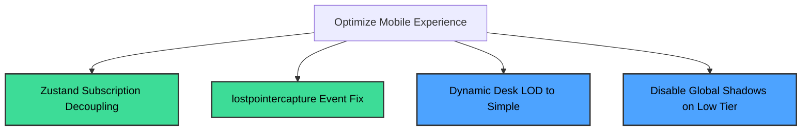

# Mobile / GPU Optimization Recommendations: Realme P2 Pro
**Date:** 2026-07-14  
**Device Profile:** Realme P2 Pro (Qualcomm Snapdragon 7s Gen 2 SoC, Adreno 710 GPU)  
**AgentVerse Version:** 0.2.10 (git e5d61cf) - Always-full Expanded HQ  

---

## 1. Ranked Root Causes of Sluggish Scene & Stuck Joystick

### Root Cause 1: High-Frequency React Re-renders during Movement (Critical CPU Bottleneck)
*   **Mechanism:** `TouchJoystick.tsx` updates `playerMoveInput` at the display's touch poll rate (up to 120Hz on Realme P2 Pro). In `PlayerAvatar.tsx`, the store subscription `useVerseStore((s) => s.playerMoveInput)` triggers on every change. 
*   **Result:** React is forced to reconcile `PlayerAvatar` and its heavy child `RpmAvatar` (which performs GLTF skeletal cloning, material adjustments, and animation blending) multiple times per second. 
*   **Cascade Effect:** Similarly, `FirstPersonControls.tsx` and `FramingControls.tsx` subscribe to `playerPosition`, causing further re-renders. This CPU main-thread starvation blocks the browser's touch event thread, causing severe input lag, delayed event processing, and stuck joystick physics.

### Root Cause 2: Missing `lostpointercapture` Event Handler (High Touch Bug)
*   **Mechanism:** `TouchJoystick.tsx` calls `setPointerCapture` during pointerdown to lock touch tracking to the joystick container. It relies on `onPointerUp` and `onPointerCancel` to reset `active.current` and zero out player movement inputs.
*   **Result:** On Android Chrome, OS back-swipe gestures, scroll boundaries, or severe frame lag can cause the browser to revoke pointer capture, dispatching a `lostpointercapture` event.
*   **Cascade Effect:** Because `onLostPointerCapture` is not listened to, the cleanup handler is never executed. The joystick's internal ref `active.current` remains `true` and the knob stays stuck in the translated position, causing the player to walk infinitely in that direction.

### Root Cause 3: Excessive Geometry and Light Draw Calls (High GPU Bottleneck)
*   **Mechanism:** Version 0.2.10 removed distance culling and made LOD always full. This means all **10 team wings** (totaling **60 individual desks** and chairs) are rendered at max complexity, regardless of camera distance.
*   **Result:** Each `AgentDesk` renders dual monitors, desk clutter, keyboard, mouse, ergonomic chairs, office plants, and a **table lamp point light**.
*   **Cascade Effect:** Rendering **60 point lights** in addition to the global lighting (ambient, directional, spot) creates a massive pixel-shader calculation loop. Over **900 draw calls** and shadow-casting calculations overwhelm the budget Adreno 710 GPU, dragging performance down to 10-15 FPS.

### Root Cause 4: Global Shadow Maps and Glass Transmission Passes (Medium GPU Bottleneck)
*   **Mechanism:** The `low` tier profile in `perf-profile.ts` keeps `shadows: true` and `contactShadows: true` enabled. Additionally, the glass material in `SiruseriOffice.tsx` and `SideConferenceBlock.tsx` uses physical `transmission` (opacity refraction).
*   **Result:** Although directional shadows are disabled for the low tier in `OfficeLighting.tsx`, Three.js still compiles and processes shadow pipelines globally. The physical transmission on glass forces Three.js to render extra frame-buffer textures (refraction maps) on every frame.

---

## 2. Concrete Recommendations Ranked by Performance Impact & Visual Risk

To preserve the **always-full Expanded HQ** visual requirement of PROD (where all desk wings are visible and the office doesn't look empty), these recommendations are designed to cut rendering overhead with minimal to zero visual compromise.



### Recommendation 1: Decouple Zustand Subscriptions from React Render Loop
*   **Priority:** Rank 1 (Critical)
*   **Visual Risk:** **None (Zero Compromise)**
*   **Action:** 
    *   In [PlayerAvatar.tsx](file:///E:/Myworkspace/agentverse-project/src/components/scene/PlayerAvatar.tsx), remove the React hook subscription `const moveInput = useVerseStore((s) => s.playerMoveInput);`. Instead, retrieve the value directly inside `useFrame` using `const moveInput = useVerseStore.getState().playerMoveInput;`.
    *   In [FirstPersonControls.tsx](file:///E:/Myworkspace/agentverse-project/src/components/scene/FirstPersonControls.tsx) and [FramingControls.tsx](file:///E:/Myworkspace/agentverse-project/src/components/scene/FramingControls.tsx), remove `const playerPosition = useVerseStore((s) => s.playerPosition);` and access it dynamically inside `useFrame` with `const playerPosition = useVerseStore.getState().playerPosition;`.
    *   Inside [PlayerAvatar.tsx](file:///E:/Myworkspace/agentverse-project/src/components/scene/PlayerAvatar.tsx)'s frame loop, guard the animation state setter to prevent redundant updates:
        ```typescript
        const moving = len > 0.05;
        if (walking !== moving) {
          setWalking(moving);
        }
        ```
*   **Impact:** Eliminates 100% of React component re-renders during movement. The main thread is freed up, immediately resolving joystick responsiveness issues and input lag.

### Recommendation 2: Handle Pointer Capture Loss in Touch Joystick
*   **Priority:** Rank 2 (Critical Bugfix)
*   **Visual Risk:** **None (Zero Compromise)**
*   **Action:** 
    *   In [TouchJoystick.tsx](file:///E:/Myworkspace/agentverse-project/src/components/hud/TouchJoystick.tsx), bind the `onLostPointerCapture` event handler to your reset callback:
        ```typescript
        onPointerUp={end}
        onPointerCancel={end}
        onLostPointerCapture={end}
        ```
*   **Impact:** Guarantees the joystick resets and halts character movement whenever the browser or OS interrupts the touch sequence, preventing the "stuck joystick" symptom.

### Recommendation 3: Enable Dynamic Level-of-Detail (LOD) for Desks
*   **Priority:** Rank 3 (High GPU/CPU Relief)
*   **Visual Risk:** **Extremely Low (Desks remain 100% visible)**
*   **Action:** 
    *   In [HubScene.tsx](file:///E:/Myworkspace/agentverse-project/src/components/scene/HubScene.tsx), change `TeamClustersLayer` to accept the performance profile's LOD setting:
        ```diff
        - <TeamCluster key={zone.id} zone={zone} lod="full" proxy={false} showLabels={showLabels} />
        + <TeamCluster key={zone.id} zone={zone} lod={profile.lod} proxy={false} showLabels={showLabels} />
        ```
    *   In [perf-profile.ts](file:///E:/Myworkspace/agentverse-project/src/lib/perf-profile.ts), update the `low` tier profile to return `lod: "simple"` instead of `lod: "full"`.
*   **Impact:** All 60 desks, chairs, monitors, and character avatars remain fully rendered in 3D (respecting the "always-full Expanded HQ" design). However, tiny high-frequency detail meshes (mice, keyboards, desk clutter, plants) and **60 table-lamp point lights** are culled. This saves hundreds of draw calls and reduces shader calculations.

### Recommendation 4: Turn off Shadow Maps Globally on Low-Tier
*   **Priority:** Rank 4 (High GPU Relief)
*   **Visual Risk:** **Low (Slightly softer ambient lighting)**
*   **Action:** 
    *   In [perf-profile.ts](file:///E:/Myworkspace/agentverse-project/src/lib/perf-profile.ts), change `shadows: true` to `shadows: false` for the `low` tier.
*   **Impact:** Since directional/spot shadows are already disabled on the low tier, setting this to `false` prevents Three.js from compiling and executing shadow map rendering pipelines. The floor is still grounded by `ContactShadows` (which uses a custom FBO pass independent of global shadow maps).

### Recommendation 5: Disable Heavy Secondary Features on Low-Tier
*   **Priority:** Rank 5 (Medium GPU Relief)
*   **Visual Risk:** **Medium (Minor visual simplifications)**
*   **Action:**
    *   In [perf-profile.ts](file:///E:/Myworkspace/agentverse-project/src/lib/perf-profile.ts), adjust the `low` profile to disable the central glass cube, glass refraction (transmission), and ambient walkers:
        ```typescript
        showGlassCube: false,
        ambientWalkers: false,
        ```
*   **Impact:** Eliminates the heaviest shader calculations (glass refraction/transmission passes) and removes extra animated 3D meshes (ambient walkers), saving precious render cycles on the Adreno 710 GPU.
